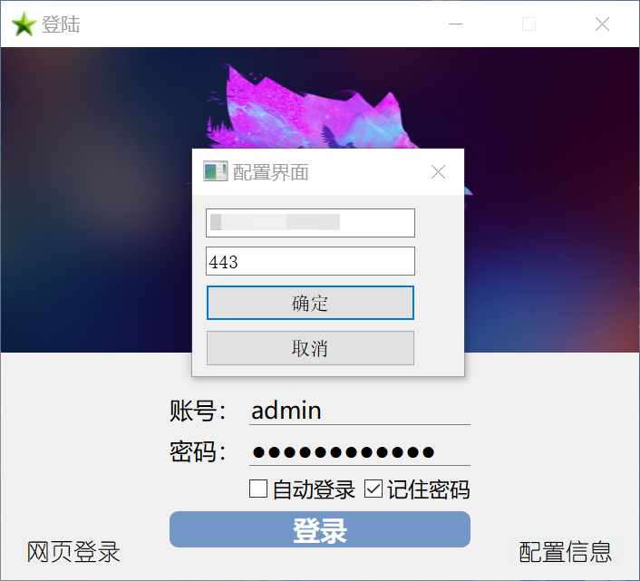
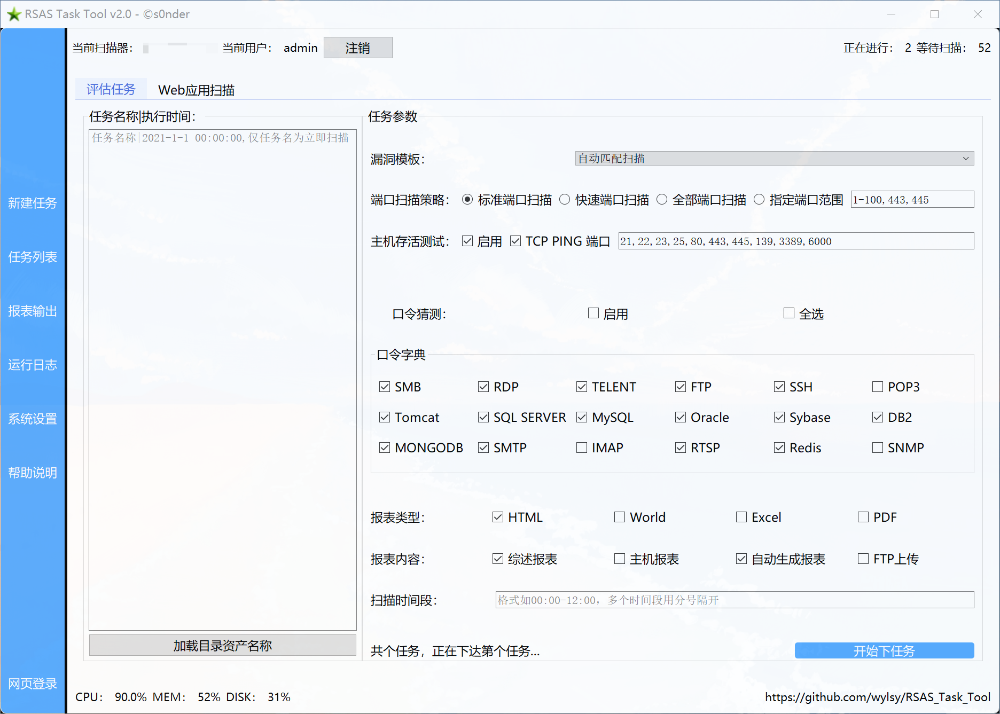
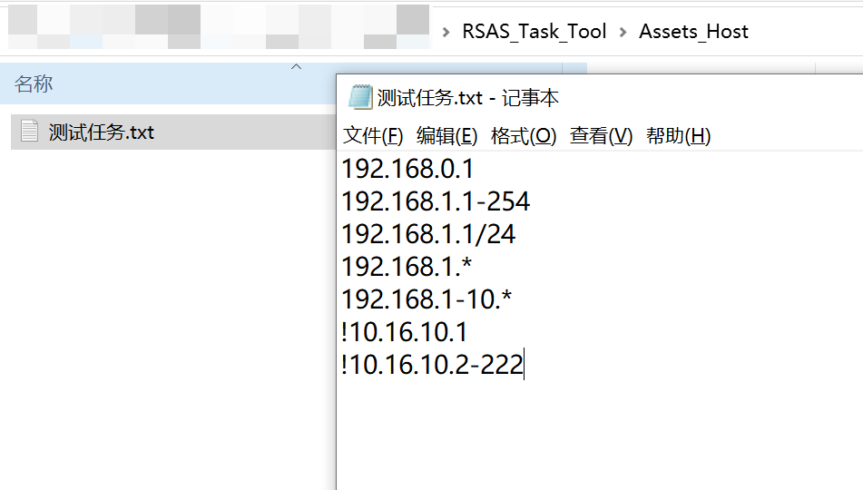
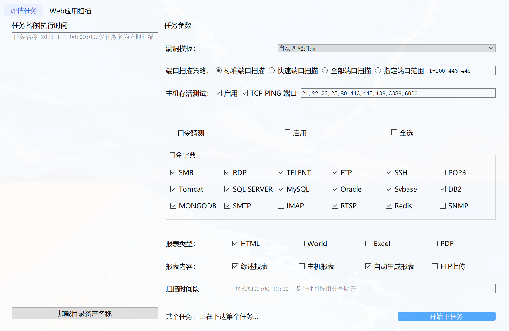
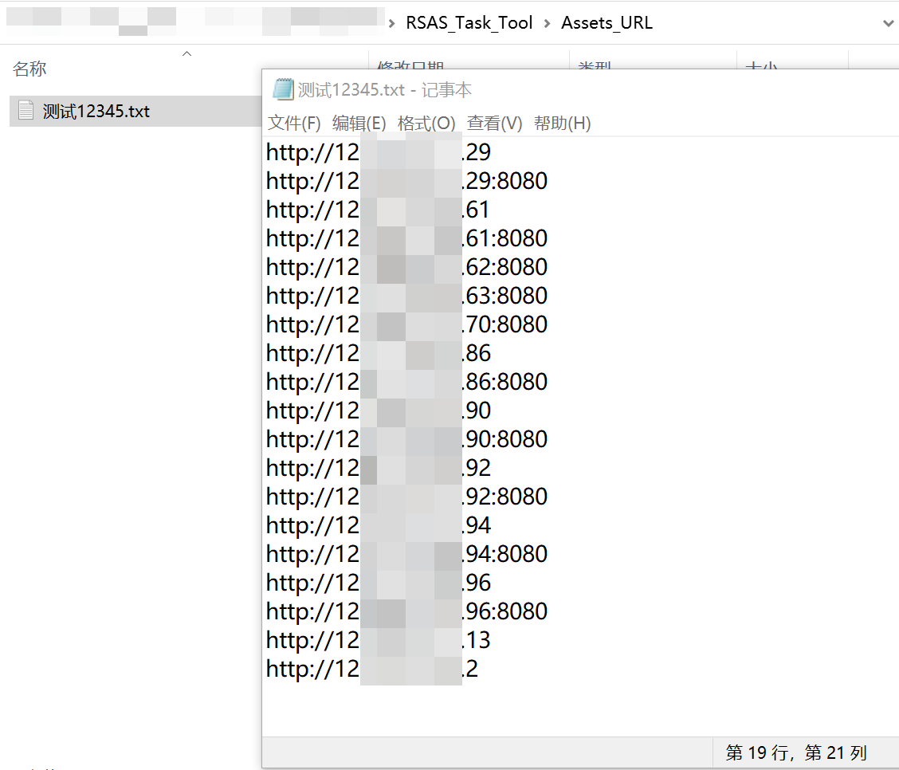
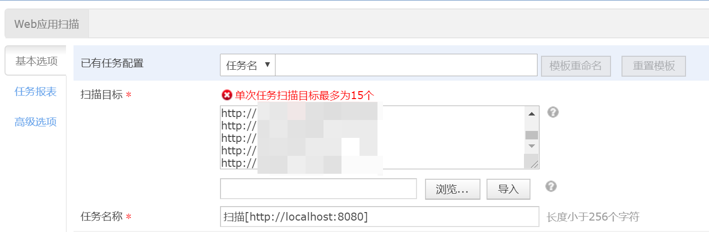
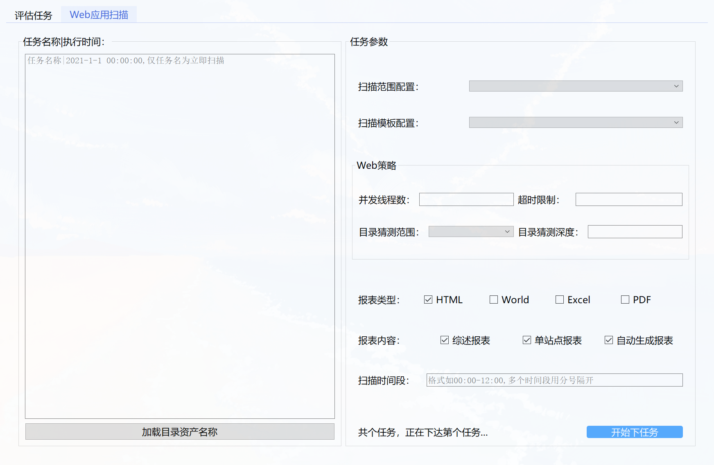
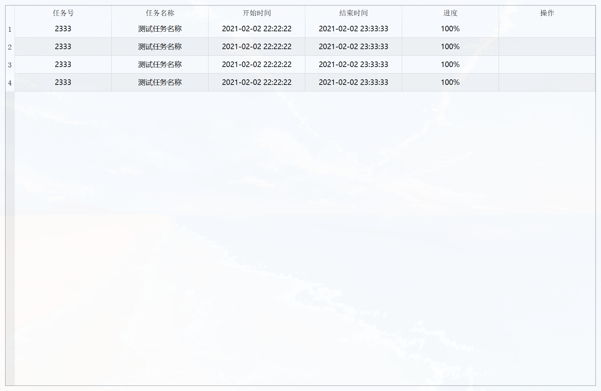

<h1 align="center">RSAS_Task_Tool</h1>

<div align="center">

[](https://github.com/wylsy)
[](https://github.com/wylsy/RSAS_Task_Tool)
[](https://github.com/wylsy/RSAS_Task_Tool)

</div>

简体中文 | [English](./README_EN.md) 

## 0x01 简介

🐱‍🐉绿盟科技NSFOCUS_极光远程安全评估系统(RSAS) Python-GUI(pyqt5) 批量添加扫描任务、批量下载扫描报告等一系列功能扩展工具。

🐱‍💻Python + pyqt5编写，界面与逻辑分离，采用requests模拟请求的方式实现，非官方数据接口，所有扫描器都能用。

🤡个人练习项目，代码写的有些拖沓，如有改进的地方，期待各位大佬指点。

------
#### 扩展功能

* [x] 主机扫描（批量）
* [x] Web扫描（批量）
* [ ] 扫描任务管理
* [ ] 扫描报告下载
* [ ] 自定义报告导出
* [ ] 扩展脚本
------
## 0x02 使用

### 安装Python3依赖：

```
pip3 install -r requirements.txt -i https://pypi.tuna.tsinghua.edu.cn/simple some-package
```

### 运行程序：

```python
python3 main.py
```

首次启动软件需配置扫描器IP和端口，且会当前目录下建立扫描资产文件夹（Assets_URL和Assets_Host）



登录成功



### 新建任务：

#### 扫描任务名称

**资产文件夹下txt文件名需即为扫描任务名称**

可点击`加载目录资产名称`按钮直接从对应资产文件夹下加载要扫描txt文件名，方便批量立即扫描

```code
[任务名称|扫描时间]
任务名称1		#任务名称和设定的扫描时间，只填任务名称是立即扫描
任务名称2|2021-1-1 00:00:00
任务名称3|2021-1-2 10:30:00
```

#### 主机扫描

Host_Assets文件夹下txt文件名需与任务名称相匹配，txt里的IP地址是一行一个，这样的：

```code
192.168.0.1
192.168.1.1-254
192.168.1.1/24
192.168.1.*
192.168.1-10.*
!10.16.10.1
!10.16.10.2-222
```

> **待优化：如果txt里的ip存在"、"或其他暂未发现会报错字符：`1.1.1.22-23、25-26`，可能会提示找不到任务资产。**



**评估任务界面参数**



#### WEB扫描

URL_Assets文件夹下txt文件名需与任务名称相匹配，txt里的url是一行一个，这样的：

```
http://127.0.0.1
http://localhost:8080
https://github.com/
```



> 因绿盟扫描器限制，单次任务扫描目标**最多为15个**，此程序下任务时会对单个任务扫描目标大于15个进行任务拆分。



> **待优化：绿盟扫描器在建立任务时会对扫描的每个URL地址进行站点访问测试，不可访问的站点使用此程序下载任务时会失败。**


**Web应用扫描界面参数**

> 如果此扫描器未购买Web应用扫描模块，则获取的参数都为空



### 任务列表（功能未完成）：



### 报表输出（功能未完成）：


#### 网页登录

这里**暂时**使用了`Selenium`打开浏览器自动填充账号密码登录，`WebDriver驱动`使用了`Microsoft Edge (Chromium)` ，后续可能会改用其他方法。

如果你点击这个按钮提示版本不符，请自行下载本机`Microsoft Edge`版本对应的`WebDriver驱动`并替换此程序目录下的`msedgedriver.exe`

Microsoft Edge（Chromium）的驱动msedgedriver 下载地址：https://developer.microsoft.com/en-us/microsoft-edge/tools/webdriver/

------
## 0x03 演示


<div align=center></div>

<div align=center></div>

<div align=center></div>

------
## 0x04 更新

- **2021/06/28	因工作原因，接触不到绿盟扫描器了，暂时告一段落吧**

- 2021/04/27	1、更新了新的UI界面
                2、解决了一些小问题
                3、又发现了一些小问题

- 2021/01/29	1、新增WEB扫描
                2、新增目录资产读取功能
                3、发现一些小问题

- 2021/01/22	放弃命令行，选择构建UI界面

- 2020/12/25	上传RSAS_Task_Tool项目

------
## 0x05 完结✿✿ヽ(°▽°)ノ✿

https://github.com/wylsy/RSAS_Task_Tool

------

------
